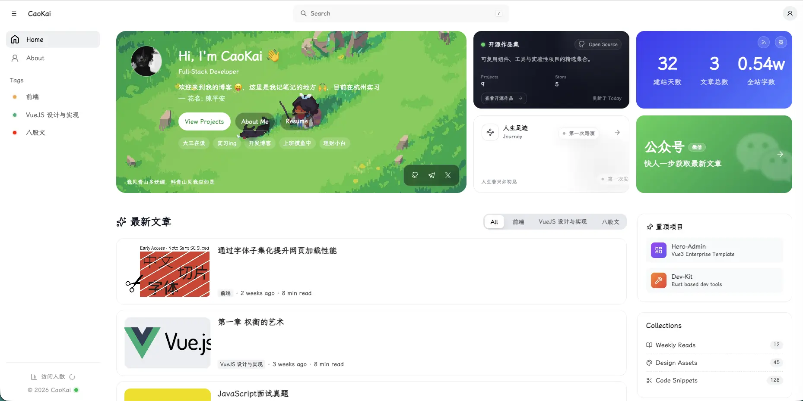
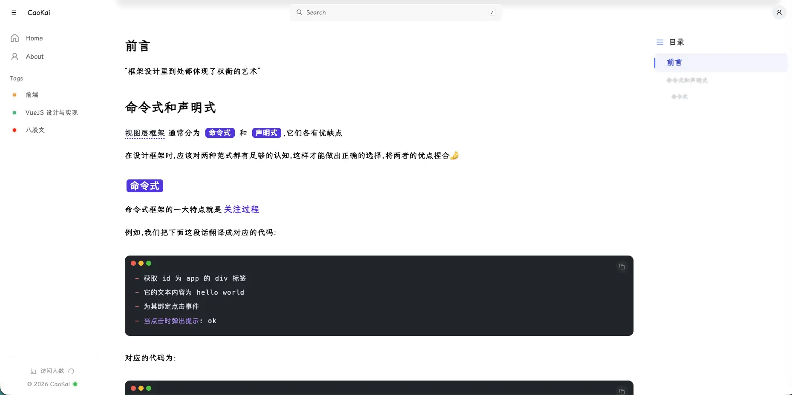
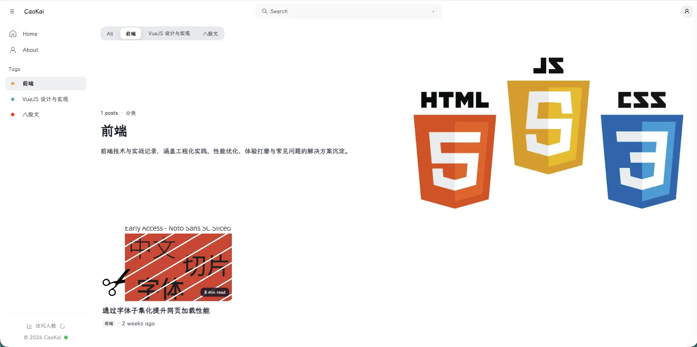

# CaoKai Blog

简洁而专注的个人技术博客，基于 Vue 3 + Vite SSG + Markdown。

- 在线预览: https://blog.caoki.cn
- 技术栈: Vue 3 / Vite SSG / Ant Design Vue / Markdown

**功能亮点**

- Markdown 写作与 Frontmatter 元数据
- 文章目录、代码高亮与一键复制
- 标签与分类聚合，中文自动转拼音 slug
- SEO 友好：sitemap、robots、RSS/Atom、OG/JSON-LD
- 个人主页卡片与开源数据卡片（GitHub 仓库/Star 统计）
- 纯静态部署，构建产物位于 `dist/`

**功能预览**




**快速开始**

环境要求: Node `^20.19.0` 或 `>=22.12.0`

1. 安装依赖

```bash
pnpm install
```

2. 本地开发

```bash
pnpm dev
```

3. 生产构建与预览

```bash
pnpm build
pnpm preview
```

**写作**

在 `posts/<分类>/<标题>.md` 中新增文章

Frontmatter 示例:

```yaml
---
title: 字体子集化实战
description: 面向中文字体的前端性能优化实践
date: 2026-01-19
tags:
  - 前端性能优化
  - Web 字体
coverImage: https://example.com/cover.webp
wordCount: 1800
readTime: 8
location: 杭州
comments: 12
---
```

**站点配置**

主配置在 `site.config.json`，可修改站点信息、作者信息、社交链接、标签封面与颜色等。

评论区（Giscus）可在 `site.config.json > comments.giscus` 配置，关键参数包括：

- `comments.enabled`（是否启用）
- `repo` / `repoId`
- `category` / `categoryId`
- `mapping`（推荐 `pathname`）
- `strict`（推荐 `true`）
- `lang` / `theme`

**开源协议**

本项目采用 MIT 协议，详见 `LICENSE`。
